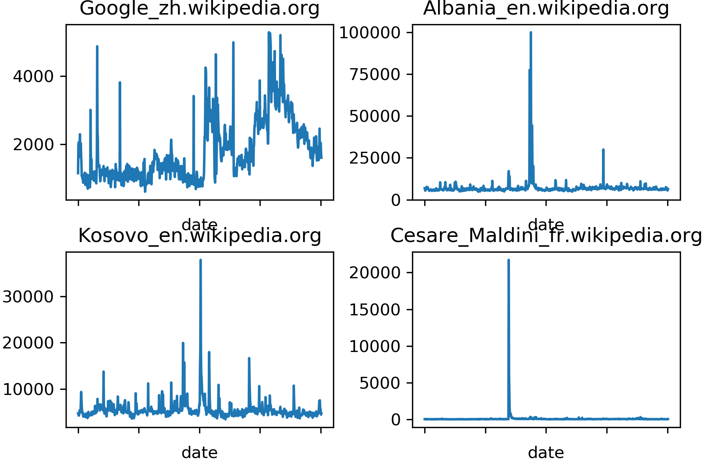
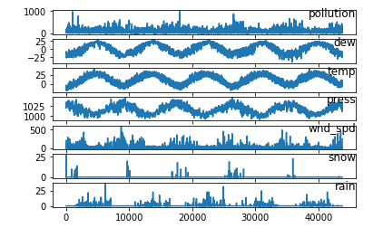

```{r setup, include=FALSE}
knitr::opts_chunk$set(echo = TRUE)
knitr::opts_chunk$set(fig.pos = 'h')
```

## Dataset Selection

The two dataset's we've selected are:

1. Kaggle *Web Traffic Time Series Forecasting* Challenge from Google.

    + The training dataset consists of approximately 145k time series. We've reduced the dataset to a smaller version with 6 different articles. Each of these time series represent a number of daily views of a different Wikipedia article, starting from July, 1st, 2015 up until September 1st, 2017.

    + For each time series, we are provided with the name of the article as well as the type of traffic that this time series represent (all, mobile, desktop, spider). Unfortunately, the data source for this dataset does not distinguish between traffic values of zero and missing values. A missing value may mean the traffic was zero or that the data is not available for that day.

```{r, echo = FALSE, fig.align = 'center', fig.cap = "\\label{fig:figs}Daily hits of different Wikipedia articles"}

```

2. Air Pollution Forecasting

    + This dataset contains daily values for pollution, dew, temperature, pressure, wind direction, wind speed, snow,  and rain starting from January, 1st, 2010 up until December 31th, 2014.

```{r, echo = FALSE, fig.align = 'center', fig.cap = "\\label{fig:figs}Visualized variables of the pollution.csv dataset"}

```

## Forecasting Models

As our main models we intend to use a variation of recurrent neural networks (RNN) called **long short-term memory networks** (LSTM). Recurrent nets are a type of artificial neural network designed to recognize patterns in sequences of data, such as text, genomes, handwriting, the spoken word, or numerical times series data emanating from sensors, stock markets and government agencies. These algorithms take time and sequence into account, they have a temporal dimension.

We also want to compare our LSTM to something else, that's why we've also decided to use the python library **Prophet**. Prophet is open source software released by Facebook's Core Data Science team. It is a procedure for forecasting time series data based on an additive model where non-linear trends are fit with yearly, weekly, and daily seasonality, plus holiday effects. It works best with time series that have strong seasonal effects and several seasons of historical data. Moreover, Prophet is robust to missing data and shifts in the trend, and typically handles outliers well.

## Forecast Accuracy Measure

Considering we're working with numerical values only, we've chosen Root Mean Square Error (RMSE) as our forecast accuracy measure. RMSE is the standard deviation of the residuals (prediction errors). Residuals are a measure of how far from the regression line data points are; RMSE is a measure of how spread out these residuals are. In other words, it tells you how concentrated the data is around the line of best fit.

$$RMSE = \sqrt{\frac{1}{n}\Sigma_{i=1}^{n}{\Big(\frac{d_i -f_i}{\sigma_i}\Big)^2}}$$

## Implementation Choices

Considering all of our team members are experienced in python and the wide range of libraries it offers, we designed our implementation choices around it. We will be using Keras for deep learning and more specifically long short-term memory networks. We'll also be using the Prophet library released by Facebook to compare our results from LSTM's. Data will be managed with Pandas and NumPy. The process will look something similar to: `Dataset prepration -> Handling missing values -> LabelEncoding -> Scaling -> Model training -> Model prediction -> Evaluation`. This doesn't mean that this process will be final, and we won't change something, if needed, during the development phase.