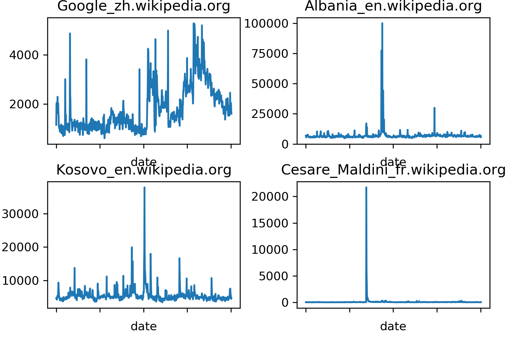
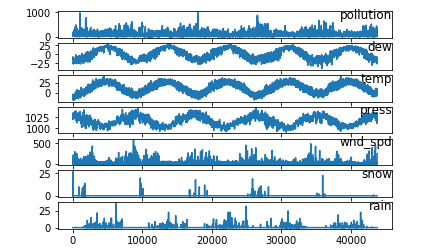

\newpage 
\tableofcontents
\newpage

```{r setup, include=FALSE}
knitr::opts_chunk$set(echo = TRUE)
```

## Characteristics of data sets, classifiers, performance measures and pre-processing


### Data sets 

We have chosen two datasets with these characteristics:

#### Kaggle Web Traffic Time Series Forecasting Challenge

The training dataset consists of approximately 145k time series. We've reduced the dataset to
a smaller version with 6 different articles. Each of these time series represent a number of daily
views of a different Wikipedia article, starting from July, 1st, 2015 up until September 1st, 2017.
For each time series, we are provided with the name of the article as well as the type of traffic that
this time series represent (all, mobile, desktop, spider). Unfortunately, the data source for this
dataset does not distinguish between traffic values of zero and missing values. A missing value
may mean the traffic was zero or that the data is not available for that day.

```{r, out.width = "500px", echo = FALSE, fig.align = 'center', fig.cap = "\\label{fig:figs}Daily hits of different Wikipedia articles"}

```

#### Air Pollution Forecasting
This dataset contains daily values for pollution, dew, temperature, pressure, wind direction, wind
speed, snow, and rain for the city of Bejing, China starting from January, 1st, 2010 up until December 31th, 2014.It has a large number of samples 43801, and small number of attributes 9. This dataset contains no missing values.

```{r, out.width = "500px", echo = FALSE, fig.align = 'center', fig.cap = "\\label{fig:figs}Daily hits of different Wikipedia articles"}

```

### Forecasting Methods

#### LSTM

Long short-term memory (LSTM) is an artificial recurrent neural network architecture used in the field of deep learning. It can process complete information sequences like speech or video not only single information points like pictures. A normal LSTM unit consists of a cell, an input gate, an output gate and a forget gate. The cell recalls values over arbitrary times interval, and the three gates control data flows into and out of the cell.

LSTM networks are well suited to classify, process and make projections based on time series information, as there may be lags of unknown length in a time series between significant occurrences. LSTMs have been created to cope with the explosive and disappearing gradient issues that can be experienced in traditional RNN training. LSTM has an edge over RNNs, concealed Markov models and other sequence learning techniques in many apps.

An RNN using LSTM units can be trained in a controlled manner, on a set of training sequences, using an optimization algorithm such as gradient descent, coupled with time backpropagation to calculate the gradients required during the optimization phase, to alter each weight of the LSTM network in proportion to the error derivative in relation to the respective weight. 

#### Prophet

Prophet is open source software released by Facebook's Core Data Science team. It is a
procedure for forecasting time series data based on an additive model where non-linear trends are fit with
yearly, weekly, and daily seasonality, plus holiday effects. It works best with time series that have strong
seasonal effects and several seasons of historical data. Moreover, Prophet is robust to missing data and shifts
in the trend, and typically handles outliers well.

At its core, the Prophet procedure is an additive regression model with four main components:

* A piecewise linear or logistic growth curve trend. Prophet automatically detects changes in trends by selecting changepoints from the data.

* A yearly seasonal component modeled using Fourier series.

* A weekly seasonal component using dummy variables.

* A user-provided list of important holidays.

The significant concept in Prophet is that we model seasonality more correctly and the outcome is a more precise prediction by doing a better job of fitting the trend element very flexibly. Prophet model fits using Stan, and it has its core procedure implemented in Stan's probabilistic programming language. Stan conducts incredibly fast MAP optimization for parameters (< 1 second), and it provides the  choice to estimate parameter uncertainty using the Hamiltonian Monte Carlo algorithm,  it enables to reuse the appropriate process across various interface languages. 
 
### Explanation of choice for data sets and regressors

We have chosen Air Pollution Forecasting because it has a large number of samples that we can counduct our regressor models, and we chose Kaggle Web Traffic Time Series Forecasting Challenge because we could select from many articles to perfrom our regressors functions.

### Performance measures

#### RMSE

Considering we're working with numerical values only, we've chosen Root Mean Square Error (RMSE) as our forecast accuracy measure. Root-mean-square error is a frequently used measure of the variations between the expected values of a model or estimator and the observed values, RMSE is the standard deviation of the residuals (prediction errors). Residuals are a measure of how far from the regression line data points are; RMSE is a measure of how spread out these residuals are. In other words, it tells you how concentrated the data is around the line of best fit.

$$RMSE = \sqrt{\frac{1}{n}\Sigma_{i=1}^{n}{\Big(\frac{d_i -f_i}{\sigma_i}\Big)^2}}$$

### Pre-processing 

#### Handling of missing values

To handle the missing value we have used two approaches:

1. For numerical feature, the missing value is filled by the mean of that feature, i.e. we have
filled the missing value with the sum of all values of the corresponding feature divided by
the number of values of that feature (Missing value = sum(n-feature) / n-feature). If the attribute has more than 70% of missing values we do not consider its impact in the result.

2. For nominal feature, the missing value is filled by the mode of that feature, i.e. by the
most recursive nominal value of that feature.

## Experiments and results

### First dataset

### Second dataset

### Record (approximate) runtimes of the forecasting methods

## Conclusion

## Bibliography
