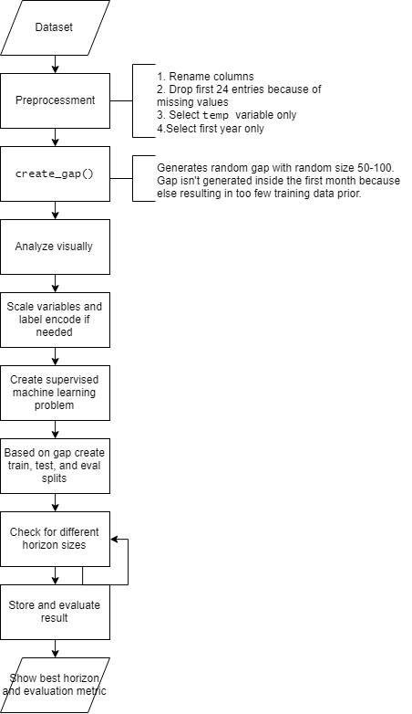

\newpage 
\tableofcontents
\newpage

```{r setup, include=FALSE}
knitr::opts_chunk$set(echo = TRUE)
knitr::opts_chunk$set(fig.pos = 'h')
```

## Characteristics of data sets, classifiers, performance measures and pre-processing

### Data sets 

We have chosen two datasets with these characteristics:

#### Kaggle Web Traffic Time Series Forecasting Challenge

The training dataset consists of approximately 145k time series. We've reduced the dataset to
a smaller version with 6 different articles. Each of these time series represent a number of daily
views of a different Wikipedia article, starting from July, 1st, 2015 up until September 1st, 2017.
For each time series, we are provided with the name of the article as well as the type of traffic that
this time series represent (all, mobile, desktop, spider). Unfortunately, the data source for this
dataset does not distinguish between traffic values of zero and missing values. A missing value
may mean the traffic was zero or that the data is not available for that day.

```{r, out.width = "500px", echo = FALSE, fig.align = 'center', fig.cap = "\\label{fig:figs}Daily hits of different Wikipedia articles"}
knitr::include_graphics('images/web_traffic.png')
```

#### Air Pollution Forecasting
This dataset contains daily values for pollution, dew, temperature, pressure, wind direction, wind speed, snow, and rain for the city of Bejing, China starting from January, 1st, 2010 up until December 31th, 2014.It has a large number of samples 43801, and small number of attributes 9. This dataset contains no missing values.

```{r, out.width = "500px", echo = FALSE, fig.align = 'center', fig.cap = "\\label{fig:figs}Daily hits of different Wikipedia articles"}
knitr::include_graphics('images/pollution.png')
```

### Forecasting Methods

#### LSTM

Long short-term memory (LSTM) is an artificial recurrent neural network architecture used in the field of deep learning. It can process complete information sequences like speech or video not only single information points like pictures. A normal LSTM unit consists of a cell, an input gate, an output gate and a forget gate. The cell recalls values over arbitrary times interval, and the three gates control data flows into and out of the cell.

LSTM networks are well suited to classify, process and make projections based on time series information, as there may be lags of unknown length in a time series between significant occurrences. LSTMs have been created to cope with the explosive and disappearing gradient issues that can be experienced in traditional recurrent neural network (RNN) training. LSTM has an edge over RNNs, concealed Markov models and other sequence learning techniques in many apps.

An RNN using LSTM units can be trained in a controlled manner, on a set of training sequences, using an optimization algorithm such as gradient descent, coupled with time backpropagation to calculate the gradients required during the optimization phase, to alter each weight of the LSTM network in proportion to the error derivative in relation to the respective weight. 

#### Prophet

Prophet is open source software released by Facebook's Core Data Science team. It is a procedure for forecasting time series data based on an additive model where non-linear trends are fit with yearly, weekly, and daily seasonality, plus holiday effects. It works best with time series that have strong seasonal effects and several seasons of historical data. Moreover, Prophet is robust to missing data and shifts in the trend, and typically handles outliers well.

At its core, the Prophet procedure is an additive regression model with four main components:

* A piecewise linear or logistic growth curve trend. Prophet automatically detects changes in trends by selecting changepoints from the data.

* A yearly seasonal component modeled using Fourier series.

* A weekly seasonal component using dummy variables.

* A user-provided list of important holidays.

The significant concept in Prophet is that we model seasonality more correctly and the outcome is a more precise prediction by doing a better job of fitting the trend element very flexibly. Prophet model fits using Stan, and it has its core procedure implemented in Stan's probabilistic programming language. Stan conducts incredibly fast MAP optimization for parameters (< 1 second), and it provides the  choice to estimate parameter uncertainty using the Hamiltonian Monte Carlo algorithm,  it enables to reuse the appropriate process across various interface languages. 
 
### Explanation of choice for data sets and regressors

We have chosen Air Pollution Forecasting because it has a large number of samples that we can counduct our regressor models, and we chose Kaggle Web Traffic Time Series Forecasting Challenge because we could select from many articles to perfrom our regressors functions.

### Performance measures

#### RMSE

Considering we're working with numerical values only, we've chosen Root Mean Square Error (RMSE) as our forecast accuracy measure. Root-mean-square error is a frequently used measure of the variations between the expected values of a model or estimator and the observed values, RMSE is the standard deviation of the residuals (prediction errors). Residuals are a measure of how far from the regression line data points are; RMSE is a measure of how spread out these residuals are. In other words, it tells you how concentrated the data is around the line of best fit.

$$RMSE = \sqrt{\frac{1}{n}\Sigma_{i=1}^{n}{\Big(\frac{d_i -f_i}{\sigma_i}\Big)^2}}$$

### Pre-processing 

#### Handling of missing values

To handle the missing value we've used multiple approaches:

1. Manually specify column names

2. Drop the first 24 hours because all of them have missing values

3. Mark all NA values with 0, excluding nominal features where the missing value is filled by the mode of that feature, i.e. by the most recursive nominal value of that feature.

\newpage

## Experiments and results

### Experiment Setting

In Figure 3 we've defined a workflow on how experiments for this assignment will be executed. This definition helped us in developing the most efficient way to get this work done.

Firstly the dataset is preproccessed, where we manually specify column names, drop the first 24 hours because all of them have missing values, mark all NA values with 0. After that three distinct random gaps are created in the dataset, which afterwards are analyzed visually to gain more insight into the problems.

Now predictions are made possible by creating a supervised machine learning problem out of our data, based on that train, test and eval splits are created. Different horizon sizes are checked, and the best results are stored and evaluated, which then are displayed.


```{r, out.width = "500px", echo = FALSE, fig.align = 'center', fig.cap = "\\label{fig:figs}Experiment workflow"}

```

### Pollution dataset

#### Using LSTM

In Figure 4 we've plotted three charts, which indicate the predictions of the three gaps created in the Pollution dataset. Here the LSTM with it's gradient descent algorithm shines, using backpropagation to create the best results possible.

LSTM follows trends very nicely, although lacks accuracy in predicting higher values compared to lower ones where it doesn't underestimate said values.

```{r, out.width = "500px", echo = FALSE, fig.align = 'center', fig.cap = "\\label{fig:figs}Pollution Gap Predictions using LSTM"}
knitr::include_graphics('images/Web Traffic LSTM.png')
```

#### Using Prophet

The Pollution dataset is where Prophet works best, because this dataset contains timeseries that have strong seasonal effects and several seasons of historical data.

In Figure 5 we've plotted the predicted gaps by calling the Prophet.plot method and passing in our forecast dataframe. Where the predictions we've made are displayed. Here we can see the continuation of the daily trends in previous values from our predicted ones.

```{r, out.width = "500px", echo = FALSE, fig.align = 'center', fig.cap = "\\label{fig:figs}Pollution Gap Predictions using Prophet"}
knitr::include_graphics('images/Pollution Prophet.png')
```

#### Performance metris

Both models forecasted with a high accuracy, which can be concluded from the RSME values in Figure 6. Here the LSTM performored better by a close margin. The higher RMSE in gap three is suspected to be from the extreme low temperature values which had to be predicted in that gap, which both models failed to do so correctly. Therefore failing on the lower boundary of that gap.

```{r, out.width = "500px", echo = FALSE, fig.align = 'center', fig.cap = "\\label{fig:figs}Pollution Gap Predictions using Prophet"}

```

### Web Traffic dataset

#### Using LSTM

In Figure 7 we can see the predictions made by LSTM, where the predictions for the lower boundary were more accurate then predictions for the upper boundary. The predicitions for each gap were generated independently of each other, where the red line represents our predictions and the green line the actual values.

```{r, out.width = "500px", echo = FALSE, fig.align = 'center', fig.cap = "\\label{fig:figs}Web Traffic Predictions using LSTM"}
knitr::include_graphics('images/Web Traffic LSTM.png')
```

#### Using Prophet

In Figure 8 we can see the predictions made by Prophet to predict the missing gap values for the Web Traffic dataset. As seen in Figure 8, it also fills each gap independently of each other, where it first fills values from first gap than continues to the second and third one. Prophet was quite good at predicting these missing gap values as displayed on the plots.

```{r, out.width = "500px", echo = FALSE, fig.align = 'center', fig.cap = "\\label{fig:figs}Web Traffic Predictions using Prophet"}
knitr::include_graphics('images/Web Traffic Prophet.png')
```

#### Performance metris

In Figure 9 we can see the RMSE values for LSTM and Prophet for each gap. According to the RMSE, Prophet performed a little bit better than LSTM, but not significantly. The RMSE results were worse for Web Traffic than for Pollution dataset because the Web Traffic dataset contains higher values and also can have trends, like the Chernobyl Wikipedia Site example mentioned in the slides. Where daily hits on the Wikipedia page increased drasticly, after the release of the HBO mini-series "Chernobyl" increased drasticly, therefore effecting our results.

```{r, out.width = "500px", echo = FALSE, fig.align = 'center', fig.cap = "\\label{fig:figs}Pollution Gap Predictions using Prophet"}

```

### Record (approximate) runtimes of the forecasting methods

In Figure 10 we can see approximate runtimes for both datasets, Web Traffic and Pollution, for both forecasting methods LSTM and Prophet. Fitting the models always took longer than predicting values for all gaps. Also LSTM is dependent on how many epochs you train your neural network, therefore it took longer to train. It is worth mentioning that you can add more epochs to your model, which can result in an increase in performance as well. The Pollution dataset took longer for fitting and predicting due to its large number of samples.

```{r, out.width = "500px", echo = FALSE, fig.align = 'center', fig.cap = "\\label{fig:figs}Record (approximate) runtimes of the forecasting methods. LEFT: Prophet. RIGHT: LSTM"}

```

## Conclusion

In this report we've taken two forecasting methods (LSTM and Prophet) and used them on two different datasets (Pollution and Web Traffic). To measure the performance of our methods we've used RMSE.

Some of the datasets have needed to be preprocessed due to missing values. In order to get better performance measures we've applied other preprocessing steps (such as scaling, filling missing values, dropping missing values) in datasets.

We spent most of our time coding and exploring all the options the two mentioned forecasting methods (libraries) offer in Python. The options and possibilities on what to do are limitless. We often found ourselves trying out new stuff and finding out that it didn't help our measurement scores as much as we initially thought.

We've limited the report to just some of the charts, figures and tables we've created due to otherwise resulting in a very long report.

## Project repository

https://github.com/gentrexha/energy_efficient_ds

